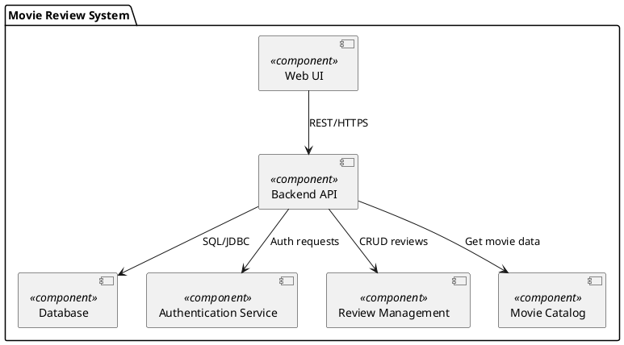
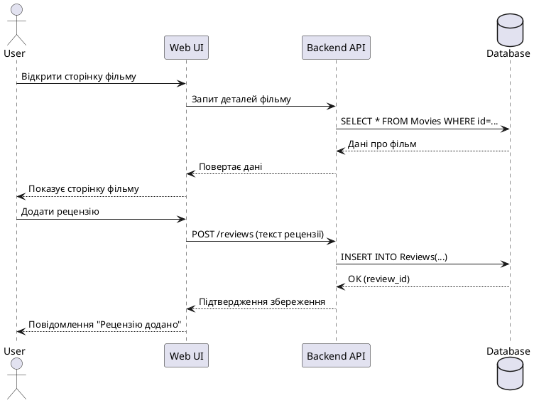

# High-Level Design: Movie Review System

## Архітектурний стиль
Для даного проекту обрано **модульну клієнт-серверну архітектуру** з використанням REST API.  
- Клієнтська частина (Web UI) відповідає за взаємодію з користувачем.  
- Серверна частина (Backend API) обробляє запити, забезпечує автентифікацію та взаємодію з базою даних.  
- База даних зберігає інформацію про фільми та рецензії.  

---

## Діаграма компонентів

### Опис компонент

* **Web UI** – інтерфейс користувача для перегляду фільмів та додавання рецензій.
* **Backend API** – серверна частина, що надає REST API для клієнта.
* **Database** – реляційна база даних для зберігання фільмів, рецензій та користувачів.
* **Authentication Service** – модуль для авторизації та аутентифікації користувачів.
* **Review Management** – модуль для створення, редагування, видалення та отримання рецензій.
* **Movie Catalog** – модуль для отримання даних про фільми (назва, опис, жанр, рейтинг).

### Інтерфейси між компонентами

* **Web UI → Backend API**: REST/HTTPS запити (`GET /movies`, `POST /reviews`, `POST /auth/login`).
* **Backend API → Database**: SQL-запити через JDBC/ORM для отримання/збереження даних.
* **Backend API → Authentication Service**: Auth-запити для перевірки токенів і авторизації.
* **Backend API → Review Management**: CRUD операції з рецензіями.
* **Backend API → Movie Catalog**: Отримання даних про фільми для відображення на Web UI.

---

## Діаграма розгортання

### Опис розгортання

* **User** – кінцевий користувач, який взаємодіє з Web UI через браузер.
* **Web UI** – фронтенд-додаток, який відправляє HTTP-запити до Backend API.
* **Backend API** – обробляє запити користувача, керує логікою бізнес-процесів та взаємодіє з базою даних.
* **Database** – реляційна база даних PostgreSQL, що зберігає інформацію про фільми, рецензії та користувачів.
